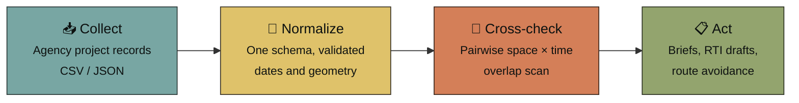
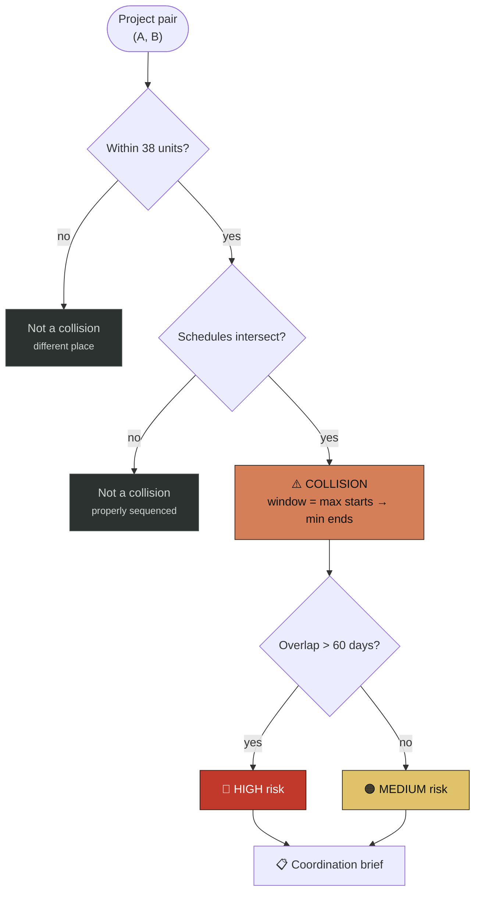
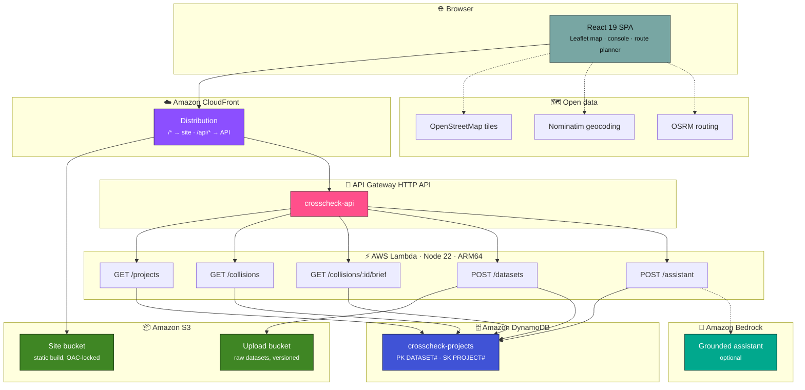
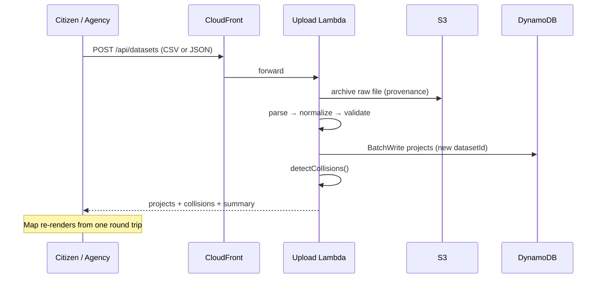

<div align="center">

# CROSSCHECK

### See the collisions before they happen.

**Infrastructure intelligence for cities that keep digging up the same road.**

[](http://crosscheckstack-sitebucket397a1860-y125rsu1upvh.s3-website.ap-south-1.amazonaws.com)

[](#-license)


</div>

---


## The problem

A road gets resurfaced in June. In August, the water board digs a trench down the middle of it to renew a main. In October, the electricity utility opens the same stretch for a feeder diversion. By December, the road department is back to repair the damage caused by the other two.

Every one of those decisions was reasonable in isolation. Each department had a budget, a mandate and a schedule. **None of them could see the others.**

The result is a road that was paid for three times, a corridor that was closed for eight months instead of three, and a public that assumes someone is corrupt when the real failure is that four planning systems never talk to each other.

This is not a coordination problem. It is a **visibility problem** — and visibility is a software problem.

> [!NOTE]
> CrossCheck does not stop construction, and it should not. Cities need to dig. What CrossCheck does is surface the overlap **early enough that the sequencing conversation can still happen** — while the schedule is a draft rather than a trench.

---

## 🎯 What CROSSCHECK does

CrossCheck ingests public-works project records from multiple agencies and finds every pair of projects that overlap **in space and in time**. Those pairs are collisions: the moments where one department is about to undo another's work.

| | Capability | What it actually does |
|---|---|---|
| 🧠 | **Collision detection** | Pairwise scan over every project pair; flags those overlapping in both location and schedule |
| 🗺️ | **Live map** | Leaflet + OpenStreetMap with toggleable Projects, Traffic, Construction, Collisions and Road-closure layers |
| 🧭 | **Disruption-aware routing** | Real OSRM routes, ranked by how many detected disruption zones each one crosses |
| 🔍 | **Filter & search** | By agency, by infrastructure type (Water, Roadworks, Metro, Electrical, Telecom, Drainage), or free text |
| 📄 | **Coordination briefs** | Generates a plain-text brief per collision: agencies, overlap window, proximity, risk, recommended sequencing |
| 📬 | **RTI / records drafts** | Turns a detected collision into a ready-to-send request for the coordination record |
| 📤 | **Bring your own data** | Upload CSV or JSON; records are archived, normalised, stored and re-scanned server-side |
| 💬 | **Grounded assistant** | Answers questions about the dataset from the computed collision facts, not from model recall |
| 💸 | **Avoidable-rework estimate** | Costs the detected overlap using a per-km resurfacing rate plus a coordination cost per collision |

### The headline finding

Running the engine over the seeded 12-project Bengaluru dataset returns **4 collisions across 6 agencies** — including exactly the story above:

| Collision | Agencies | Proximity | Overlap | Window | Risk |
|---|---|---|---|---|---|
| **Richmond Road** | BWSSB × BBMP | 72 m | **75 days** | 2024-08-01 → 2024-10-15 | 🔴 HIGH |
| MG Road / 100 Feet Road | BMRCL × ACT Fibernet | 95 m | 77 days | 2024-08-20 → 2024-11-05 | 🔴 HIGH |
| Bellary Road | BMRCL × Jio Digital Life | 95 m | 70 days | 2025-02-05 → 2025-04-16 | 🔴 HIGH |
| 80 Feet Road | BWSSB × BESCOM | 94 m | 51 days | 2024-12-02 → 2025-01-22 | 🟠 MEDIUM |

Richmond Road is the whole thesis in one row: a **water main renewal** and a **road resurfacing**, 72 metres apart, running concurrently for 75 days. Resurface, then trench. Detected before either crew mobilises, it is a scheduling conversation. Detected after, it is a re-dig.

---

## 🗺️ Product views

> **[▶ Open the live demo](https://crosscheck-kocuecpj.manus.space)**

| View | What you're looking at |
|---|---|
| **Hero / Story** | The five-interruption timeline for a single road — resurfaced, dug, dug, dug, repaired |
| **Detect** | The road-network visual: four utility routes converging on one collision node |
| **Network** | The operating console — live Leaflet map, layer toggles, filters, project inspector, collision briefs, route planner |
| **Intelligence** | Avoidable-rework counter, ward coordination scores, next-likely-collision forecast, RTI generator, embeddable widget |
| **Impact** | Aggregate totals computed from the current dataset — projects, collisions, agencies, overlap metres, overlap days |

<details>
<summary><b>📸 Adding screenshots</b></summary>

<br>

The gallery below renders once you drop captures into `docs/screenshots/`. Capture at 1600×1000 on a dark theme:

| File | Capture |
|---|---|
| `hero.png` | Landing hero with the headline |
| `console.png` | The `#network` operating console, collision panel open |
| `route.png` | Route planner with alternatives and the disruption list |
| `intelligence.png` | Avoidable-rework and coordination-score cards |

```html
<div align="center">
  
  
  
  
</div>
```

</details>

---

## ⚙️ How it works

Four moves, deliberately simple:



1. **Collect** — project records arrive as CSV or JSON. The raw file is archived to S3 before anything touches it, so a normalised row can always be traced back to what a department actually submitted.
2. **Normalize** — rows are mapped onto one schema. Records missing a name, agency, valid type, ISO dates, location or coordinates are dropped rather than guessed at.
3. **Cross-check** — every pair of projects is tested for spatial proximity **and** schedule intersection. Both must hold.
4. **Act** — each collision becomes a brief with named agencies, an overlap window and a sequencing recommendation.

---

## 🧠 The collision-detection logic

A collision requires **two independent conditions to hold simultaneously**. Neither alone means anything: two crews on the same road six months apart is good sequencing; two crews on the same road in the same week is a re-dig.

### 1. Spatial overlap

Euclidean distance between project footprints, thresholded:

```ts
export const SPATIAL_THRESHOLD = 38;

export function spatialOverlap(a: Project, b: Project): boolean {
  return Math.hypot(a.x - b.x, a.y - b.y) < SPATIAL_THRESHOLD;
}
```

### 2. Schedule overlap

Classic interval intersection — two ranges overlap if each begins before the other ends:

```ts
export function dateOverlap(a: Project, b: Project): boolean {
  return new Date(a.start) <= new Date(b.end)
      && new Date(b.start) <= new Date(a.end);
}
```

### 3. The pairwise scan

An upper-triangular sweep, so each pair is evaluated exactly once and never mirrored:

```ts
export function detectCollisions(source: Project[]): Collision[] {
  return source.flatMap((project, index) =>
    source.slice(index + 1).flatMap((other) => {
      if (!spatialOverlap(project, other) || !dateOverlap(project, other)) return [];

      // The collision window is the INTERSECTION of the two schedules.
      const start = new Date(project.start) > new Date(other.start) ? project.start : other.start;
      const end   = new Date(project.end)   < new Date(other.end)   ? project.end   : other.end;
      const distance = Math.hypot(project.x - other.x, project.y - other.y);

      return [{
        id: `${project.id}-${other.id}`,
        projects: [project, other],
        road: project.road === other.road ? project.road : `${project.road} / ${other.road}`,
        start, end,
        spatial:  `${Math.round(100 - distance * 1.2)}m`,
        schedule: `${Math.max(1, Math.round((+new Date(end) - +new Date(start)) / 86_400_000))} days`,
      }];
    }),
  );
}
```

The window is the **intersection**, not the union — the days both crews are actually live on the same stretch. That number drives the risk grade: over 60 days is `HIGH`.



### 4. Route disruption analysis

For routing, project footprints are projected to WGS84 and tested against the real road geometry returned by OSRM. Any project within a **550 m corridor** of any point on the route counts as a disruption on that route:

```ts
export function toLatLng(project: Project): [number, number] {
  return [12.9716 + (240 - project.y) / 2500, 77.5946 + (project.x - 500) / 2500];
}

export function routeDisruptions(geometry: [number, number][], source: Project[]): Project[] {
  return source.filter((project) => {
    const [lat, lon] = toLatLng(project);
    return geometry.some(([routeLon, routeLat]) =>
      Math.hypot((routeLat - lat) * 85000, (routeLon - lon) * 100000) < ROUTE_BUFFER_METERS);
  });
}
```

Alternatives come back from OSRM ranked by travel time; CrossCheck re-ranks them by **disruption count** and preselects the cleanest one.

> [!IMPORTANT]
> `x` / `y` are planar coordinates from the original client. The engine was ported to the backend **without changing a single threshold or formula**, so browser and Lambda produce byte-identical results. The regression suite in `backend/src/domain/collision.test.ts` pins this: same 12 projects in, same 4 collisions out.

---

## 🏗️ Architecture



**Why this shape.** The SPA and the API sit behind one CloudFront distribution, so the browser makes same-origin `/api/*` calls — no CORS preflight, one domain to ship, one certificate to manage. Detection runs in Lambda rather than the browser because the dataset is the product: it needs to be shared between users, auditable, and larger than a page load. The frontend keeps its bundled dataset as a fallback, so an unreachable backend degrades to the demo instead of an empty map.

### Request flow: uploading a dataset



---

## ☁️ AWS services

Every service below is provisioned by the CDK stack in `infrastructure/`.

| Service | Role in CrossCheck |
|---|---|
| **AWS Lambda** | Five handlers, Node 22 on ARM64, ESM bundles via esbuild. One function per route, 512 MB, 10–30 s timeouts |
| **API Gateway (HTTP API)** | Public REST surface with CORS preflight; Lambda proxy integrations |
| **Amazon DynamoDB** | Single-table store, `PK=DATASET#<id>` / `SK=PROJECT#<id>`. A dataset is one partition, so a full scan is one Query. On-demand billing, PITR enabled |
| **Amazon S3** | Two buckets — the static site (locked to CloudFront via Origin Access Control) and raw dataset uploads (versioned, SSE-S3, 365-day lifecycle) |
| **Amazon CloudFront** | Single distribution serving the SPA and proxying `/api/*`; SPA fallback routing on 403/404 |
| **Amazon Bedrock** | *Optional.* Grounded assistant — dataset facts are computed first and passed as context. Unset the model id and it falls back to a deterministic responder |
| **Amazon CloudWatch Logs** | Per-function log groups, 30-day retention |
| **AWS IAM** | Least privilege: read-only table access for query handlers, write scoped to upload and seed paths, Bedrock invoke scoped to one model ARN |
| **AWS CloudFormation / CDK** | The whole stack as TypeScript. Seeding runs through a custom resource on deploy |

<details>
<summary><b>🔌 API reference</b></summary>

<br>

| Method | Route | Returns |
|---|---|---|
| `GET` | `/projects?datasetId=&type=&agency=&q=` | Filtered project records plus a summary block |
| `GET` | `/collisions?datasetId=` | Enriched collisions, longest overlap first |
| `GET` | `/collisions/{collisionId}/brief?format=brief\|rti` | Plain-text coordination brief or RTI draft |
| `POST` | `/datasets` | Archives, normalises and stores an upload; returns recomputed collisions |
| `POST` | `/assistant` | Grounded answer over the current dataset |

```bash
curl "$API/collisions" | jq '.collisions[0] | {road, spatial, schedule, risk}'
```
```json
{ "road": "MG Road / 100 Feet Road", "spatial": "95m", "schedule": "77 days", "risk": "HIGH" }
```

</details>

---

## 🛠️ Tech stack

| Layer | Technology |
|---|---|
| **UI** | React 19 · TypeScript 5.6 · Vite 7 · Tailwind CSS 4 |
| **Components** | Radix UI primitives (shadcn/ui) · lucide-react · framer-motion · sonner |
| **Mapping** | Leaflet 1.9 · OpenStreetMap tiles · inline SVG network visuals |
| **Routing (app)** | wouter |
| **Geo services** | Nominatim geocoding · OSRM driving routes with alternatives |
| **Backend** | Node 22 · TypeScript · AWS SDK v3 · esbuild |
| **Data** | DynamoDB single-table · S3 raw archive |
| **Infrastructure** | AWS CDK v2 (TypeScript) |
| **Testing** | `node:test` regression suite over the detection engine |

---

## 📂 Project structure

```
CROSSCHECK/
├── frontend/                       # React SPA — the interface in the live demo
│   ├── client/
│   │   ├── index.html
│   │   └── src/
│   │       ├── pages/Home.tsx      # ★ the entire product surface
│   │       ├── lib/api.ts          # ★ API client, falls back to bundled data
│   │       ├── components/ui/      # Radix / shadcn primitives
│   │       ├── contexts/           # theme
│   │       ├── hooks/
│   │       └── index.css           # design system
│   ├── server/index.ts             # local static preview server
│   └── vite.config.ts
│
├── backend/                        # Lambda handlers
│   └── src/
│       ├── domain/
│       │   ├── collision.ts        # ★ the detection engine
│       │   ├── collision.test.ts   # regression suite
│       │   └── types.ts
│       ├── handlers/
│       │   ├── projects.ts         # GET  /projects
│       │   ├── collisions.ts       # GET  /collisions
│       │   ├── brief.ts            # GET  /collisions/:id/brief
│       │   ├── upload.ts           # POST /datasets
│       │   ├── assistant.ts        # POST /assistant
│       │   └── seed.ts             # deploy-time seeding
│       ├── lib/
│       │   ├── repository.ts       # DynamoDB access
│       │   └── http.ts             # responses, CSV/JSON parsing, validation
│       └── seed/projects.ts        # the 12-project Bengaluru dataset
│
└── infrastructure/                 # AWS CDK
    ├── bin/crosscheck.ts
    ├── lib/crosscheck-stack.ts     # ★ every AWS resource
    └── cdk.json
```

---

## 🚀 60-second demo

1. **Open the console** — scroll to `#network`. Twelve projects across six agencies render on the Bengaluru map.
2. **Find the collision** — the amber markers are detected collisions. Click **Richmond Road**.
3. **Read the brief** — two agencies, 72 m apart, overlapping for 75 days. A water main renewal and a road resurfacing, concurrently.
4. **Download it** — *Download brief* produces the coordination memo; the intelligence section turns the same finding into an RTI draft.
5. **Route around it** — enter `Indiranagar → MG Road`. Real OSRM alternatives come back ranked by how many disruption zones each crosses.
6. **Bring your own data** — upload a CSV of your own ward's projects. It is archived, normalised, stored and re-scanned; the map redraws against your records.

---

## 💻 Local setup

**Prerequisites:** Node 20+, npm. For deployment: an AWS account, credentials configured, and a bootstrapped CDK environment.

```bash
git clone https://github.com/Vratika-1425/CROSSCHECK-.git
cd CROSSCHECK-
npm install                 # root tooling (esbuild for Lambda bundling)
npm run bootstrap           # installs frontend, backend and infrastructure
```

### Run the frontend

```bash
cd frontend
cp .env.example .env
npm run dev                 # http://localhost:3000
```

With no `VITE_API_BASE_URL` set, the app runs entirely on its bundled dataset — the full UI works with no AWS account. Point that variable at a deployed API to switch to live data.

### Run the tests

```bash
cd backend && npm test
```

### Deploy to AWS

```bash
# once per account/region
npx cdk bootstrap aws://<account-id>/<region>

npm run deploy              # builds the frontend, then deploys the stack
```

CDK builds the SPA, uploads it to S3, provisions the API and Lambdas, creates the table, seeds the demo dataset and wires CloudFront. It prints `SiteUrl` and `ApiUrl` on completion.

<details>
<summary><b>Configuration</b></summary>

<br>

| Variable | Where | Purpose |
|---|---|---|
| `VITE_API_BASE_URL` | frontend | API base path. Unset → same-origin `/api` |
| `VITE_API_ENABLED` | frontend | `false` runs on bundled data only |
| `BEDROCK_MODEL_ID` | deploy env | Enables the Bedrock assistant. Unset → deterministic responder |
| `CDK_DEFAULT_REGION` | deploy env | Target region, defaults to `ap-south-1` |
| `PROJECTS_TABLE` | Lambda | Set by CDK |
| `UPLOAD_BUCKET` | Lambda | Set by CDK |

Lambda bundling uses local esbuild when available and Docker otherwise. `npm install` at the root provides it.

```bash
npm run destroy   # tear down all AWS resources
```

</details>

---

## ✅ Status: implemented vs planned

Everything in this table marked **Implemented** is working code in this repository, verified by a build, a test run and a CDK synth.

| Area | Status | Detail |
|---|---|---|
| React SPA, full UI | ✅ Implemented | Identical to the live demo — hero, story, console, intelligence, impact |
| Leaflet map + layer toggles | ✅ Implemented | Projects, Traffic, Construction, Collisions, Road closures |
| Collision detection engine | ✅ Implemented | Space × time pairwise scan, covered by a regression suite |
| Filters, search, project inspector | ✅ Implemented | By type, agency and free text |
| Route planning + disruption ranking | ✅ Implemented | Nominatim geocoding, OSRM alternatives, 550 m corridor check |
| Collision briefs & RTI drafts | ✅ Implemented | Generated client-side and via `GET /collisions/:id/brief` |
| CSV / JSON dataset upload | ✅ Implemented | Server path archives to S3 + DynamoDB; client fallback parses locally |
| Avoidable-rework, ward scores, forecast | ✅ Implemented | Computed from the active dataset |
| Lambda API (5 routes) | ✅ Implemented | Builds and bundles; deploys via CDK |
| DynamoDB store + deploy-time seeding | ✅ Implemented | Single-table, custom-resource seeder |
| S3 + CloudFront delivery | ✅ Implemented | OAC-locked site bucket, `/api/*` proxy behaviour |
| IAM least privilege, CloudWatch logs | ✅ Implemented | Per-function roles and log groups |
| Bedrock assistant | ⚙️ Optional | Off by default. Set `BEDROCK_MODEL_ID` to enable; falls back to a deterministic responder |
| Authentication / agency accounts | 🔜 Planned | No auth today — the API is public |
| True geospatial proximity | 🔜 Planned | Proximity is planar grid units, not surveyed metres |
| Corridor-segment detection | 🔜 Planned | Projects are compared as points, not as line segments |
| Live ingestion from tender portals | 🔜 Planned | Data arrives by upload today |
| Notifications | 🔜 Planned | No alerting yet |

> [!WARNING]
> The seeded dataset is **synthetic** and the coordinates are a planar grid anchored on Bengaluru, not survey data. The engine is real; the numbers it produces are only as good as the records fed into it. Treat outputs as a coordination prompt, not a legal finding.

---

## 🔮 Roadmap

- [ ] **Real coordinates** — replace the planar grid with PostGIS/geohash geometry so proximity is true metres, and collisions can be detected on overlapping line segments rather than point pairs
- [ ] **Live ingestion** — scheduled pulls from municipal tender portals and utility work-permit systems, replacing manual upload
- [ ] **Corridor-level detection** — treat projects as road segments, not points, so a 2 km trench is checked along its whole length
- [ ] **Agency accounts** — authenticated dashboards per department with a shared calendar and an approval workflow for overlapping windows
- [ ] **Notifications** — alert both agencies at the moment a new permit collides with an existing one, while the schedule is still a draft
- [ ] **Citizen ground-truth** — verified photo reports pinned against document-derived detections
- [ ] **Historical analysis** — re-dig frequency per corridor, to rank where coordination would save the most
- [ ] **Multi-city** — datasets beyond Bengaluru, with per-city cost baselines

---

## 🤝 Contributing

Contributions are welcome — especially **real public-works data**, which is the hardest part of this problem.

1. Fork and branch: `git checkout -b feature/your-idea`
2. Keep the detection engine covered: `cd backend && npm test`
3. Typecheck both sides: `cd frontend && npx tsc --noEmit`
4. Commit, push, and open a pull request describing the behaviour change

**Especially useful:**

- Municipal or utility project datasets in any format
- Corridor-geometry detection to replace point proximity
- Accessibility and mobile improvements to the console
- Cost-model calibration against real resurfacing tenders

If you are contributing data, note the source and licence in your PR. Provenance is the point.

---

## 📜 License

MIT — see [`LICENSE`](LICENSE).

<div align="center">
<br>

**Build cities that don't dig twice.**

[Live demo](http://crosscheckstack-sitebucket397a1860-y125rsu1upvh.s3-website.ap-south-1.amazonaws.com) · [Report an issue](https://github.com/Vratika-1425/CROSSCHECK-/issues)

</div>
